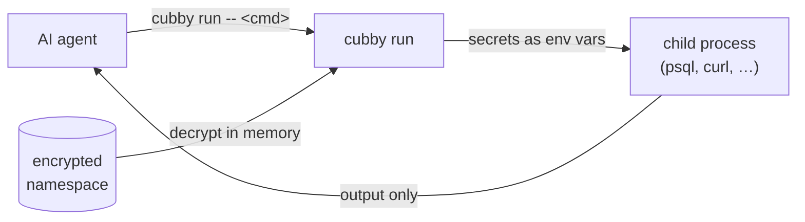

<div align="center">

# cubby

**Encrypted, namespaced secret store for AI coding agents —
secrets reach the command, never the agent's context.**

[](LICENSE)
[](https://www.python.org/)
[](#)

</div>

---

AI coding agents are great at running commands — but everything they read from a
command's output lands in their context and transcripts. Paste a database password
into a prompt once and it's logged forever.

`cubby` fixes that. Secrets live encrypted on disk (via [`age`](https://github.com/FiloSottile/age)).
The agent never reads a value — it runs `cubby run -- <command>`, and `cubby` injects
the secrets straight into the command's environment. The agent sees the command's
result, never the secret itself.

## How it works



The decrypted value exists only in the environment of the child process. It is never
printed, never written to disk in cleartext, and never enters the agent's context.

## Install

```bash
brew install age          # required: age + age-keygen (Linux: github.com/FiloSottile/age/releases)
git clone https://github.com/perlyer/cubby.git && cd cubby && ./install.sh
```

`install.sh` puts `cubby` on your `PATH`, runs `cubby init`, and offers to install the
integration into any AI coding agents it finds. Non-interactive:

```bash
./install.sh --key-mode keychain --agent claude-code,codex
```

`--key-mode keychain` (macOS) stores the age key in the login Keychain so it unlocks
automatically at login; the default `--key-mode file` keeps it in
`~/.config/cubby/identity` (mode `0600`).

## Usage

| Command | What it does |
|---------|--------------|
| `cubby init` | First-run setup — generates the age key, creates the config |
| `cubby set <name>` | Store a secret (hidden prompt, or `--stdin`) |
| `cubby get <name>` | Show metadata only — `--reveal` prints plaintext (humans only) |
| `cubby list` | List secret names in the namespace |
| `cubby rm <name>` | Delete a secret |
| `cubby run -- <cmd>` | Run a command with the namespace's secrets in its environment |
| `cubby import` | Bulk import from a `.env` file or AWS Secrets Manager |
| `cubby ns add\|list\|rm` | Manage namespaces |
| `cubby agent add\|list\|rm` | Manage AI-agent integrations |

A typical session:

```console
$ cubby set db-password
value for 'db-password': 
cubby: secret 'db-password' set in namespace 'work'

$ cubby get db-password
name:      db-password
namespace: work
length:    18
updated:   2026-05-17T09:14:02+00:00

$ cubby run -- psql -h 127.0.0.1 -U appuser -d appdb
psql (16.2)
appdb=>
```

`cubby get` never prints the value without `--reveal`; `cubby set` reads it from a
hidden prompt, so it never lands in shell history or `argv`.

## Namespaces

A namespace is a workspace or environment (`work`, `personal`, …). The active namespace
is resolved per command: `-n <name>` flag → `$CUBBY_NS` → working-directory prefix
match → default.

```bash
cubby ns add work --cwd-prefix ~/projects/work
cubby ns                  # show the active namespace and why it was chosen
```

Each namespace is a separate encrypted file. The per-namespace `env_map` (which
environment variable each secret becomes under `cubby run`, e.g.
`"db-password": "PGPASSWORD"`) is edited in `~/.config/cubby/config.json`.

## Agent integration

`cubby agent` installs a small integration — a skill or instructions file, plus a
permissions allowlist where the agent supports one — so the agent reaches for
`cubby run` instead of reading secrets in plaintext.

```bash
cubby agent list                 # adapters and their status
cubby agent add claude-code      # install the integration for one agent
cubby agent rm claude-code       # remove it
```

Supported agents: `claude-code`, `codex`, `gemini`, `cursor`, `copilot`.

Claude Code users can alternatively use the native plugin marketplace:

```
/plugin marketplace add perlyer/cubby
/plugin install cubby
```

## Security

`cubby` keeps secrets encrypted at rest and out of an agent's context — but it is a
guardrail, not a sandbox. It does not protect against a compromised machine or an
agent that runs arbitrary code. Read [SECURITY.md](SECURITY.md) for the full threat
model and how to report a vulnerability.

## Contributing

Contributions welcome — including new agent adapters (one file each). See
[CONTRIBUTING.md](CONTRIBUTING.md).

## License

[MIT](LICENSE)
