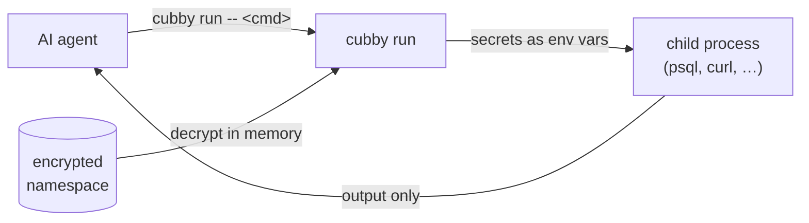

<div align="center">

# cubby

**Encrypted, namespaced secret store for AI coding agents —
secrets reach the command, never the agent's context.**

[](LICENSE)
[](https://www.python.org/)
[](#)

</div>

---

AI coding agents are great at running commands — but everything they read from a
command's output lands in their context and transcripts. Paste a database password
into a prompt once and it's logged forever.

`cubby` fixes that. Secrets live encrypted on disk (via [`age`](https://github.com/FiloSottile/age)).
The agent never reads a value — it runs `cubby run -- <command>`, and `cubby` injects
the secrets straight into the command's environment. The agent sees the command's
result, never the secret itself.

## How it works



The decrypted value exists only in the environment of the child process. It is never
printed, never written to disk in cleartext, and never enters the agent's context.

## Install

```bash
brew install age          # required: age + age-keygen (Linux: github.com/FiloSottile/age/releases)
git clone https://github.com/perlyer/cubby.git && cd cubby && ./install.sh
```

`install.sh` puts `cubby` on your `PATH`, runs `cubby init`, and offers to install the
integration into any AI coding agents it finds. Non-interactive:

```bash
./install.sh --key-mode keychain --agent claude-code,codex
```

`--key-mode keychain` (macOS) stores the age key in the login Keychain so it unlocks
automatically at login; the default `--key-mode file` keeps it in
`~/.config/cubby/identity` (mode `0600`).

### Install from PyPI

```bash
pipx install cubby
```

This puts the `cubby` command on your `PATH`. It does not set up the AI-agent
integration — run `cubby agent add <agent>` for that, or use the `git clone` +
`./install.sh` flow above, which does it for you.

## Updating

```bash
./update.sh
```

`update.sh` checks out the latest release tag in your clone, re-links `cubby` on your
`PATH`, and refreshes the agent integrations. It aborts if the working tree has
uncommitted changes. Your secret store in `~/.config/cubby/` is never touched.

## Usage

| Command | What it does |
|---------|--------------|
| `cubby init` | First-run setup — generates the age key, creates the config |
| `cubby set <name>` | Store a secret (hidden prompt, or `--stdin`); `--env VAR` sets its env var |
| `cubby get <name>` | Show metadata — `--reveal` prints plaintext, `--copy` copies it (humans only) |
| `cubby list` | List secret names in the namespace |
| `cubby rm <name>` | Delete a secret |
| `cubby rename <old> <new>` | Rename a secret |
| `cubby cp <name> <ns>` | Copy a secret to another namespace |
| `cubby mv <name> <ns>` | Move a secret to another namespace |
| `cubby rotate <name>` | Replace a secret's value (tracks a rotation count) |
| `cubby ttl [<name> [<dur>]]` | Show or change a secret's expiry |
| `cubby run -- <cmd>` | Run a command with the namespace's secrets in its environment (`--only`/`--except` to scope) |
| `cubby import <type> <src>` | Bulk import — `dotenv`, `aws`, `json`, `1password`, `ns` |
| `cubby map` | Show or change the environment variable each secret is injected as |
| `cubby ns add\|list\|rm\|use\|rename` | Manage namespaces |
| `cubby agent add\|list\|rm\|refresh` | Manage AI-agent integrations |
| `cubby doctor` | Check the install, key, config and namespaces for problems |
| `cubby completion <shell>` | Print a shell completion script (bash/zsh/fish) |
| `cubby audit` | Show or manage the opt-in audit log |
| `cubby export <file>` | Write a passphrase-encrypted backup of the whole store |
| `cubby restore <file>` | Restore the store from a backup bundle |

A typical session:

```console
$ cubby set db-password
value for 'db-password': 
cubby: secret 'db-password' set in namespace 'work'

$ cubby get db-password
name:      db-password
namespace: work
env var:   DB_PASSWORD (default)
length:    18
updated:   2026-05-17T09:14:02+00:00
expires:   never
rotated:   never

$ cubby run -- psql -h 127.0.0.1 -U appuser -d appdb
psql (16.2)
appdb=>
```

`cubby get` never prints the value without `--reveal`; `cubby set` reads it from a
hidden prompt, so it never lands in shell history or `argv`.

## Namespaces

A namespace is a workspace or environment (`work`, `personal`, …). The active namespace
is resolved per command: `-n <name>` flag → `$CUBBY_NS` → working-directory prefix
match → default.

```bash
cubby ns add work --cwd-prefix ~/projects/work
cubby ns                  # show the active namespace and why it was chosen
```

Each namespace is a separate encrypted file. Under `cubby run` every secret is
injected as an environment variable — by default the `UPPER_SNAKE` of its name
(`db-password` → `DB_PASSWORD`). To inject it under a different name, use
`cubby set <name> --env VAR` or `cubby map <name> VAR` (e.g. `db-password` →
`PGPASSWORD`); `cubby map` with no arguments lists the current mapping.

A secret can carry an optional expiry. `cubby set <name> --ttl 30d` stores it
with a 30-day TTL; `cubby ttl <name> 90d` changes the expiry later without
re-entering the value, and `cubby ttl <name> none` clears it. An expired secret
is never deleted — `cubby run` still injects it, with a warning, and
`cubby doctor` flags it. `cubby rotate <name>` replaces a secret's value and, if
it had a TTL, gives it a fresh one.

## Agent integration

`cubby agent` installs a small integration — a skill or instructions file, plus a
permissions allowlist where the agent supports one — so the agent reaches for
`cubby run` instead of reading secrets in plaintext.

```bash
cubby agent list                 # adapters and their status
cubby agent add claude-code      # install the integration for one agent
cubby agent rm claude-code       # remove it
```

Supported agents: `claude-code`, `codex`, `gemini`, `cursor`, `copilot`.

Claude Code users can alternatively use the native plugin marketplace:

```
/plugin marketplace add perlyer/cubby
/plugin install cubby
```

The integration is a convention — it *asks* the agent to use `cubby run`. For an
enforced guardrail, also block `cubby get --reveal` and `cubby get --copy` in your
agent's permission system; see [Hardening for AI agents](SECURITY.md#hardening-for-ai-agents).

## Security

`cubby` keeps secrets encrypted at rest and out of an agent's context — but it is a
guardrail, not a sandbox. It does not protect against a compromised machine or an
agent that runs arbitrary code. Read [SECURITY.md](SECURITY.md) for the full threat
model and how to report a vulnerability.

## Audit log

`cubby` can keep a local log of every time a secret value leaves the store — a
`cubby run`, a `cubby get --reveal`, or a `cubby get --copy`. It is **off by
default**; turn it on with `cubby audit --enable`. The log records a timestamp,
the event, the namespace, and (for `run`) the command — never a secret value.
`cubby audit` shows it, `cubby audit --clear` erases it. It lives at
`~/.config/cubby/audit.log`.

The log self-rotates at ~1 MB: when it reaches that size the current file is
moved to `audit.log.1` and a fresh one is started, so it never grows without
bound. `cubby audit --all` shows both the current log and the rotated history.

## Backup

Losing the age identity makes every namespace unrecoverable, so back the store
up. `cubby export backup.age` writes a single passphrase-encrypted bundle
containing the identity, config, and every namespace; `age` prompts for the
passphrase. Because the bundle is passphrase-encrypted it is safe to store
off-machine.

`cubby restore backup.age` rebuilds the store from a bundle on a fresh machine.
It refuses to overwrite an existing store unless you pass `--force`. The restored
store always uses file key-mode — if the bundle was created in keychain mode,
`cubby restore` reports this so you can re-migrate to the Keychain afterwards.

## Shell completion

`cubby completion bash` (or `zsh` / `fish`) prints a completion script for
cubby's commands. For bash, add `eval "$(cubby completion bash)"` to `~/.bashrc`;
for fish, `cubby completion fish > ~/.config/fish/completions/cubby.fish`.

## Contributing

Contributions welcome — including new agent adapters (one file each). See
[CONTRIBUTING.md](CONTRIBUTING.md).

## License

[MIT](LICENSE)
